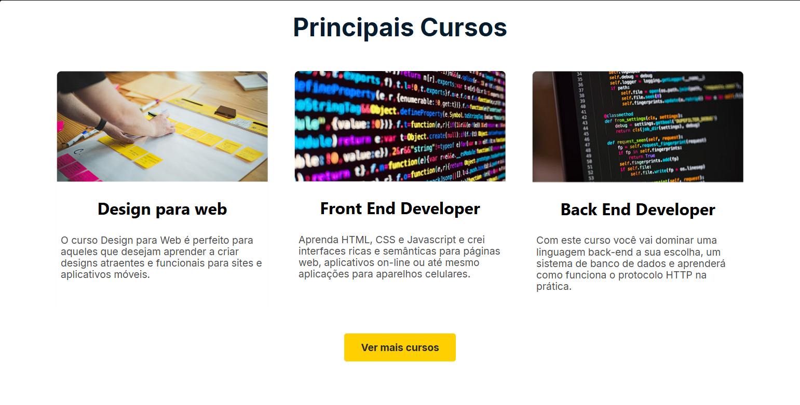

# Projeto Aprenser

### 📝 Descrição

Landing page desenvolvida para uma escola de tecnologia fictícia, criada para exercitar estruturação de layouts, design visual e responsividade com HTML5 e CSS3.

### 👀 Demonstração

#### Página inicial

Uma visão geral da interface principal do site, destacando a navegação e os elementos essenciais.


#### Tela de conteudo

**Tela de Conteúdo | Listagem de Produtos**

Esta tela exibe a lista de cursos disponíveis com uma breve descrição.

<br>

**Tela de Conteúdo | Detalhes do Produto**

Aqui, o usuário pode visualizar uma breve descrição sobre a escola.


#### Final da Página

Exemplo do rodapé no final da página, incluindo informações de contato e uso de `iframe` para apresentar a localização.


### 💻 Tecnologias utilizadas

- HTML5
- CSS3

### 🎯 Objetivos de aprendizado

- Reforço a elementos de transição.
- Pratica a conceitos básicos de `linear-gradiente`.
- Utilização de `iframe`.
- Reforço ao uso de tags semânticas no HTML5.
- Pratica ao uso do `normalizer.css`.

### 📲 Instalação

1. Clone o repositório:

```bash
git clone https://github.com/Murilo-front/Aprenser.git meu-projeto
```

2. Acesse a pasta do projeto:

```bash
cd meu-projeto
```

3. Abra o arquivo index.html no navegador:

- Clique duas vezes no arquivo ou

- Use um editor como o Visual Studio Code e a extensão Live Server.
